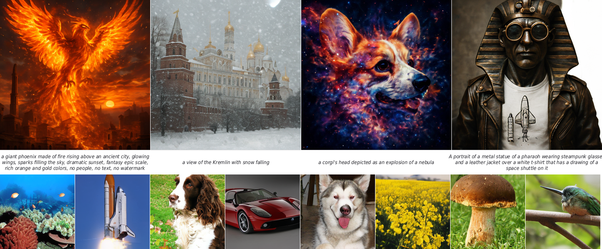
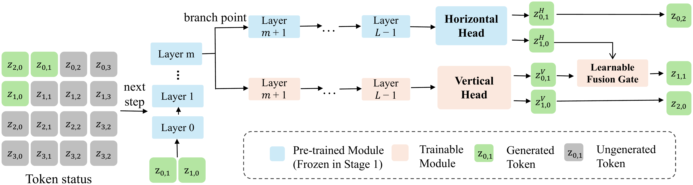
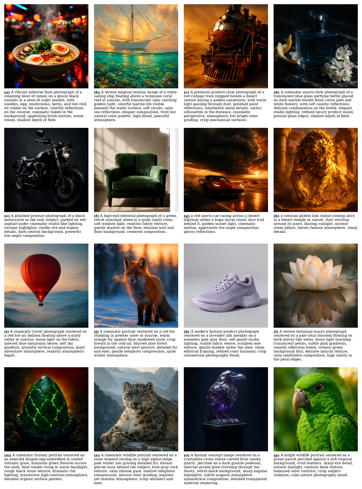

<div align='center'>
<h1>⚡ FlashAR</h1>

**Efficient Post-Training Acceleration for Autoregressive Image Generation**

[arXiv](https://arxiv.org/abs/2605.09430) | [Project Page](https://lxazjk.github.io/FlashAR/) | [🤗 HF Checkpoint](https://huggingface.co/lxazjk/Emu3.5-Image-FlashAR) | [License](LICENSE)


</div>

<br>

FlashAR speeds up a pretrained raster-scan autoregressive image generator **without retraining it from scratch and without changing the token vocabulary**. Raster-scan models emit one token at a time, so an `H × W` grid costs `H × W` serial steps. FlashAR keeps the backbone, adds a vertical prediction branch and a learnable fusion gate, and decodes along anti-diagonals — cutting the serial length to `H + W − 1`.

This repository is the **Emu3.5-Image** reference implementation: run a released checkpoint, pretokenize your own image–text data, post-train FlashAR on an Emu3.5-Image backbone, and reproduce the numbers below.

<div align='center'>

</div>

## Table of Contents

1. [Results](#1-results)
2. [Models & Weights](#2-models--weights)
3. [Installation](#3-installation)
4. [Quick Start](#4-quick-start)
5. [Training](#5-training)
6. [Benchmark: AR vs. FlashAR](#6-benchmark-ar-vs-flashar)
7. [Repository Layout](#7-repository-layout)
8. [Citation](#8-citation)

## 1. Results

**⚡ Inference efficiency — Emu3.5-Image-34B at 512 × 512.** FlashAR reaches BlockDiffusion's speed at the same post-training budget, while staying much closer to the original model's GenEval score.

| Method | Type | Steps | Data | Latency (s) | Decoding steps |
| --- | --- | ---: | ---: | ---: | ---: |
| Emu3.5-Image | From scratch | 940K | 150B | 130.10 | 1024 |
| BlockDiffusion | Post-training | 50K | 80M | 6.17 | 64 |
| **FlashAR** | Post-training | 50K | 80M | **5.68** | **63** |

**🎯 GenEval — Emu3.5-Image-34B at 512 × 512.**

| Method | Overall | Single Obj | Two Obj | Counting | Colors | Position | Color Attr |
| --- | ---: | ---: | ---: | ---: | ---: | ---: | ---: |
| Emu3.5-Image | 80.48 | 100.00 | 94.95 | 53.75 | 90.96 | 73.00 | 70.25 |
| BlockDiffusion | 73.83 | 96.88 | 88.89 | 47.50 | 85.64 | 68.00 | 58.44 |
| **FlashAR** | **80.29** | 98.75 | 91.92 | 53.75 | **92.55** | **80.00** | 64.00 |

<div align='center'>

</div>

## 2. Models & Weights

You need three components: the base model, the vision tokenizer, and a FlashAR checkpoint.

| Component | Source |
| --- | --- |
| Emu3.5-Image | [🤗 BAAI/Emu3.5-Image](https://huggingface.co/BAAI/Emu3.5-Image) |
| Emu3.5-VisionTokenizer | [🤗 BAAI/Emu3.5-VisionTokenizer](https://huggingface.co/BAAI/Emu3.5-VisionTokenizer) |
| FlashAR checkpoint | [🤗 lxazjk/Emu3.5-Image-FlashAR](https://huggingface.co/lxazjk/Emu3.5-Image-FlashAR) |

The scripts assume this layout by default:

```text
weights/
├── Emu3.5-Image/              # MODEL_PATH
└── Emu3.5-VisionTokenizer/    # VQ_PATH
checkpoints/
└── Emu3.5-Image-Flash/        # CKPT_PATH
                               # TOKENIZER_PATH → ./src/tokenizer_emu3_ibq (already in repo)
```

> 💡 To use other locations, export the matching environment variable or edit the JSON configs under `configs/`.

## 3. Installation

```bash
# Requires Python 3.10+.
python -m venv .venv
source .venv/bin/activate
pip install -r requirements/transformers.txt
pip install flash_attn==2.8.3 --no-build-isolation
```

Optionally install the repo as an editable package so imports resolve from any directory:

```bash
pip install -e .
```

## 4. Quick Start

Generate a single image once the three components are in place:

```bash
MODEL_PATH=./weights/Emu3.5-Image \
TOKENIZER_PATH=./src/tokenizer_emu3_ibq \
VQ_PATH=./weights/Emu3.5-VisionTokenizer \
CKPT_PATH=./checkpoints/Emu3.5-Image-Flash \
PROMPT="a red car parked next to a blue mailbox" \
CFG_SCALE=5.0 \
OUT_PATH=./outputs/sample.png \
bash generate.sh
```

This runs on the default 32 × 32 visual-token grid. Common options:

| Option | Description |
| --- | --- |
| `PROMPT` | Text prompt. |
| `CFG_SCALE` | Classifier-free guidance scale. |
| `OUT_PATH` | Output image path. |
| `USE_VERTICAL_BLOCK` | `auto` by default; force the branch on/off with `1`/`0`. |
| `SPLIT_BACKBONE` | Set `1` if the checkpoint was trained with split-backbone inference. |

## 5. Training

```text
raw image–text data  →  pretokenize  →  train FlashAR  →  generate & evaluate
```

### 5.1 Pretokenize

Training reads tar shards of visual tokens and captions. Each sample is a pair:

```text
<sample>.pt    # visual token tensor + shape metadata
<sample>.txt   # text prompt or caption
```

```bash
JSON_PATH=./data/GPT4o-Image/text_to_image.json \
IMAGE_ROOT=./data/GPT4o-Image \
OUTPUT_DIR=./data/GPT4o-Image_pretok_32 \
VQ_PATH=./weights/Emu3.5-VisionTokenizer \
SHARD_SIZE=5000 \
NPROC_PER_NODE=8 \
bash tokenization.sh
```

| Variable | Description |
| --- | --- |
| `JSON_PATH` | Input metadata JSON with image paths and text. |
| `IMAGE_ROOT` | Root directory for source images. |
| `OUTPUT_DIR` | Where tar shards are written. |
| `SPLIT` | Split name under `OUTPUT_DIR` (default `text_to_image`). |
| `VQ_PATH` | Emu3.5 vision tokenizer path. |
| `SHARD_SIZE` | Samples per tar shard. |
| `NPROC_PER_NODE` | Distributed pretokenization workers. |

Then point `data.pretok_glob` in the training config at the shards, e.g. `./data/GPT4o-Image_pretok_32/text_to_image_partfirst/*.tar`.

### 5.2 Train

Set your paths in `configs/train_flashar.default.json`:

```json
{
  "paths": {
    "model_path": "./weights/Emu3.5-Image",
    "tokenizer_path": "./src/tokenizer_emu3_ibq",
    "vq_path": "./weights/Emu3.5-VisionTokenizer",
    "save_dir": "./outputs/flashar_finetune",
    "resume_path": ""
  },
  "data": {
    "pretok_glob": "./data/GPT4o-Image_pretok_32/text_to_image_partfirst/*.tar"
  }
}
```

Launch:

```bash
TRAIN_CONFIG_JSON=./configs/train_flashar.default.json bash train.sh
```

Override fields without editing the config via `EXTRA_ARGS`:

```bash
# tweak the schedule
TRAIN_CONFIG_JSON=./configs/train_flashar.default.json \
EXTRA_ARGS="--max_steps 1000 --save_every_steps 100 --lr 1e-5" \
bash train.sh

# resume from a checkpoint at a lower LR
TRAIN_CONFIG_JSON=./configs/train_flashar.default.json \
EXTRA_ARGS="--resume_path ./checkpoints/Emu3.5-Image-Flash --save_dir ./outputs/continue_lr1e6 --lr 1e-6 --lr_scheduler none" \
bash train.sh
```

Most-used config fields:

| Field | Description |
| --- | --- |
| `launcher.cuda_visible_devices` | CUDA devices for `torchrun`. |
| `launcher.nproc_per_node` | Number of distributed processes. |
| `paths.model_path` | Base Emu3.5-Image model. |
| `paths.vq_path` | Emu3.5 vision tokenizer. |
| `paths.save_dir` | Checkpoint output directory. |
| `paths.resume_path` | Optional checkpoint to resume from. |
| `data.pretok_glob` | Glob for pretokenized tar shards. |
| `optimization.lr` | Main learning rate. |
| `optimization.max_steps` | Maximum optimizer steps. |
| `optimization.train_backbone` | Whether to update the backbone. |
| `model.use_vertical_block` | Enable the vertical branch. |
| `model.vertical_layers` | Number of vertical-branch layers. |

> 💡 The final checkpoint lands in `<save_dir>/flashar_final/`.

### 5.3 Evaluate

Generate images in GenEval format:

```bash
CUDA_VISIBLE_DEVICES=0 python tools/generate_geneval_flashar.py \
  --model_path ./weights/Emu3.5-Image \
  --tokenizer_path ./src/tokenizer_emu3_ibq \
  --vq_path ./weights/Emu3.5-VisionTokenizer \
  --ckpt_path ./outputs/flashar_finetune/flashar_final \
  --metadata ./datasets/geneval/prompts/evaluation_metadata.jsonl \
  --outdir ./outputs/geneval_flashar/images \
  --samples_per_prompt 4 \
  --cfg_scale 5.0 \
  --dtype bf16
```

The output tree:

```text
outputs/geneval_flashar/images/<prompt_id>/samples/0000.png
outputs/geneval_flashar/images/<prompt_id>/samples/0001.png
outputs/geneval_flashar/images/<prompt_id>/metadata.jsonl
```

Clone the official [GenEval](https://github.com/djghosh13/geneval) repo into `geneval/`, install its evaluation dependencies, then score:

```bash
CUDA_VISIBLE_DEVICES=0 python geneval/evaluation/evaluate_images.py \
  ./outputs/geneval_flashar/images \
  --outfile ./outputs/geneval_flashar/results.jsonl \
  --model-path ./weights/geneval_detectors

python geneval/evaluation/summary_scores.py \
  ./outputs/geneval_flashar/results.jsonl
```

## 6. Benchmark: AR vs. FlashAR

Side-by-side timing of standard AR decoding against FlashAR diagonal decoding:

```bash
EMU35_BENCH_FLASHAR_CKPT=./checkpoints/Emu3.5-Image-Flash \
python tools/benchmark_ar_vs_flashar.py \
  --ar_cfg configs/benchmark_t2i_ar.py \
  --flashar_cfg configs/benchmark_t2i_flashar.py \
  --out_dir outputs/bench_ar_vs_flashar
```

## 7. Repository Layout

```text
flashar/            FlashAR model, data, and training utilities
├── data/           pretokenized dataset + preprocessing
├── inference/      sampling and token-format helpers
├── model/          Emu3.5 FlashAR wrapper and decoding logic
└── utils/          config, checkpoint, optimizer, training helpers
src/                Emu3.5 model, tokenizer, VQ tokenizer, runtime utils
configs/            training and benchmark configs
tools/              GenEval, benchmarking, visualization scripts
requirements/       dependency sets
train_flashar.py    FSDP training entry
generate_flashar.py single-prompt generation entry
train.sh            config-driven torchrun launcher
generate.sh         generation launcher
tokenization.sh     pretokenization launcher
```

## 8. Citation

```bibtex
@article{zhou2026flashar,
  title={FlashAR: Efficient Post-Training Acceleration for Autoregressive Image Generation},
  author={Zhou, Junkang and He, Yefei and Chen, Feng and Wang, Weijie and Zhuang, Bohan},
  journal={arXiv preprint arXiv:2605.09430},
  year={2026}
}
```

FlashAR builds on [Emu3.5](https://github.com/baaivision/Emu3.5) by BAAI.
